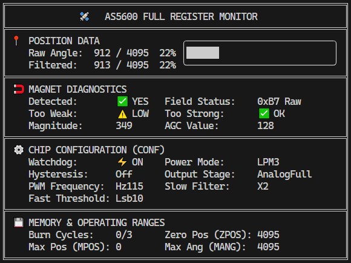

# AS5600 Driver (Rust)

[](https://opensource.org/licenses/MIT)
[](https://crates.io/crates/AS5600-Driver)

A comprehensive, low-level, platform-agnostic Rust driver for the **AS5600** magnetic rotary encoder (12-bit contactless potentiometer). Built on **`embedded-hal` 1.0**, it provides direct access to all device registers and OTP programming functions.

## 📌 Table of Contents
- [Features](#-key-features)
- [Installation](#-installation)
- [Usage Examples](#-usage-examples)
- [Interface Abstraction](#quick-start-decoupled-interface-traits)
- [I2C Bus Sharing](#-sharing-the-i2c-bus)
- [Safety Warning (OTP)](#️-safety-warning-otp-programming)
- [Support](#support-the-project--підтримати-проект)
- [License](#-license)

## 🚀 Key Features
- **no_std Support**: Ready for bare-metal microcontrollers (ESP32, STM32, nRF, etc.).
- **Full Register Map**: Complete coverage of ZPOS, MPOS, MANG, CONF, STATUS, RAW_ANGLE, ANGLE, AGC, and MAGNITUDE.
- **Hardware Configuration**: Support for Hysteresis, Power Modes, PWM settings, and Fast/Slow Filters.
- **Diagnostics**: Methods to monitor magnet detection, magnetic field strength, and Automatic Gain Control (AGC).
- **OTP Programming**: Permanent burning of settings protected by a **Command Token** pattern to prevent accidental execution.
- **Unified Async/Sync**: Identical logic for both modes thanks to internal macro unification. Full compatibility with `embedded-hal-async` 1.0.
- **Optimized Reads**: Fetch both angle and magnet status in a single I2C transaction via `read_angle_with_status`.
- **Fluent Validation**: Chainable health checks for magnet detection and field strength.
- **Mocking Support**: Built-in hardware emulator for testing and simulation, including I2C bus failure simulation.
- **defmt Support**: High-efficiency logging for embedded systems (behind the `defmt` feature).
- **Smart Configuration**: Builder pattern with intelligent Read-Modify-Write logic to preserve unedited settings.
- **Trait-based Interface**: `AS5600Interface` and `AS5600AsyncInterface` traits allow easy swapping between real hardware and mocks.
- **Cross-Platform**: Support for Linux (SBCs like Raspberry Pi), ESP32 (std & no_std), and any other platform implementing `embedded-hal`.

## 📦 Installation
Add this to your `Cargo.toml`:
```toml
[dependencies]
# Minimal synchronous version (no-std compatible by default)
AS5600-Driver = "0.1.2"

# Full version with async and mock support
AS5600-Driver = { version = "0.1.2", features = ["async", "mock"] }
```

### ⚙️ Features
- `async`: Enables asynchronous support using `embedded-hal-async`.
- `mock`: Enables the hardware mock emulator (requires `std`).
- `std`: Enables standard library support.
- `anyhow`: Enables integration with `anyhow` crate (requires `std`).
- `defmt`: Enables `defmt::Format` implementation for all public structures.

## 🛠 Usage Examples

### Single-Transaction Read with Validation (Recommended)
This method is the most efficient and safest way to get data, as it verifies magnet health and reads the angle in one I2C go.

```rust
// Chainable validation: check if magnet exists and field strength is OK
let result = encoder.read_angle_with_status()?
    .check_magnet_all()?;

println!("Angle: {}, Magnet Detected: {}", result.angle, result.status.detected);
```

### Manual Individual Reads
```rust
let i2c = I2cdev::new("/dev/i2c-1")?;
let mut encoder = AS5600Driver::new(i2c);

let raw = encoder.read_raw_angle()?;
let filtered = encoder.read_angle()?;
let status = encoder.get_magnet_status()?;
let magnitude = encoder.get_magnitude()?;
let agc = encoder.get_agc()?;

let burn_count = encoder.get_burn_count()?;
let conf = encoder.get_config()?;

let det_sym = if status.detected { "✅ YES" } else { "❌ NO " };
let low_sym = if status.too_weak { "⚠️ LOW " } else { "✅ OK  " };
let high_sym = if status.too_strong { "⚠️ HIGH" } else { "✅ OK  " };

let wd_status = if conf.watchdog { "⚡ ON " } else { "💤 OFF" };
let pm_str = format!("{:?}", conf.power_mode);
let hyst_str = format!("{:?}", conf.hysteresis);
let out_str = format!("{:?}", conf.output_stage);
let pwm_str = format!("{:?}", conf.pwm_frequency);
let slow_str = format!("{:?}", conf.slow_filter);
let fast_str = format!("{:?}", conf.fast_filter_threshold);
```

All examples provide a real-time monitoring dashboard as shown below:


\
*Typical real-time diagnostic output from the provided examples.*

We provide several ready-to-use examples for different environments:

- **[ESP32 Dashboard (std)](./example/esp-std)**: A real-time terminal dashboard for ESP32 using the `std` library and `esp-idf-hal`.
- **[ESP32 Dashboard (no_std)](./example/esp-no_std)**: Bare-metal implementation for ESP32 using `esp-hal` (no operating system).
- **[Linux Dashboard](./example/linux)**: Using the sensor on Linux-based SBCs (Raspberry Pi, etc.) via `/dev/i2c-x`.
- **[Mock Simulation](./example/mock)**: Hardware-free simulation for testing UI and logic on your PC.
- **[Async Mock Simulation](./example/async-mock)**: Demonstrates asynchronous usage with `tokio` and `embedded-hal-async`.

### Smart Configuration (Builder Pattern)
The driver features a "smart" configuration system that minimizes I2C traffic and prevents accidental overwriting of settings. Using the `apply_config` method with a `ConfigurationBuilder`, only the registers containing modified fields are accessed. 

If a register needs partial update, the driver performs a Read-Modify-Write cycle; if all fields in a register are set, it performs a direct Write.

```rust
// Only changes watchdog and power mode, preserving other settings
encoder.apply_config(
    Configuration::builder()
        .watchdog(false)
        .power_mode(PowerMode::LPM1)
)?;
```

### Quick Start: Decoupled Interface (Traits)
Using `AS5600Interface` or `AS5600AsyncInterface` allows your application logic to be independent of the specific I2C implementation.

```rust
use AS5600_Driver::AS5600Interface;

// This function works with ANY synchronous sensor implementation (Real or Mock)
fn run_diagnostic(encoder: &mut impl AS5600Interface) -> anyhow::Result<()> {
    let diag = encoder.read_all_diagnostics()?;
    println!("Position: {}, Detected: {}", diag.angle, diag.magnet_status.detected);
    Ok(())
}
```

## 🔄 Sharing the I2C Bus
The AS5600 has a **fixed I2C address (0x36)**. 

### Multiple Sensors
To use multiple AS5600 sensors on the same bus, you must use an I2C multiplexer (e.g., TCA9548A).

### Shared Bus with Other Devices
To share the bus with other device types, use a bus manager like `embedded-hal-bus`:

```rust
// Using a reference (&mut) to the I2C bus
let mut bus = I2cDriver::new(...)?;
let mut encoder1 = AS5600Driver::new(&mut bus);
// Other sensors on the same bus must have different addresses
let mut other_sensor = OtherSensor::new(&mut bus, 0x42); 
```

## ⚠️ Safety Warning: OTP Programming
The AS5600 supports permanent burning of settings to its One-Time Programmable (OTP) memory. 
This is an **irreversible** operation. To prevent accidental execution, the driver uses the **Command Token** pattern.

```rust
use AS5600_Driver::BurnToken;

// 1. Create a token to confirm your intent
let token = BurnToken::confirm_permanent_burn();

// 2. Perform the burn
sensor.permanent_burn_settings(token)?;
```

- `permanent_burn_settings(token)`: Programs ZPOS and MPOS. Max **3 times**.
- `permanent_burn_config(token)`: Programs CONF register. **ONLY ONCE**.

## Support the Project / Підтримати проект

If you find this extension useful and want to support development or speed up new features:

**Donate via:**
- 🇺🇦 [Donatello](https://donatello.to/pavver) — Ukrainian service supporting:
  - 💳 Visa/Mastercard
  - 🪙 Cryptocurrency (USDT)
  - 🏦 Other payment methods
- 🌍 PayPal: pavvers1@gmail.com

Your support helps keep this project alive and growing. Thank you! / Дякую за підтримку! 💙💛

---

You can contact me via [telegram](https://t.me/pavver) or pavvers1@gmail.com.

## 📄 License
Licensed under either of:
- Apache License, Version 2.0 ([LICENSE-APACHE](LICENSE-APACHE) or http://www.apache.org/licenses/LICENSE-2.0)
- MIT license ([LICENSE-MIT](LICENSE-MIT) or http://opensource.org/licenses/MIT)
at your option.
