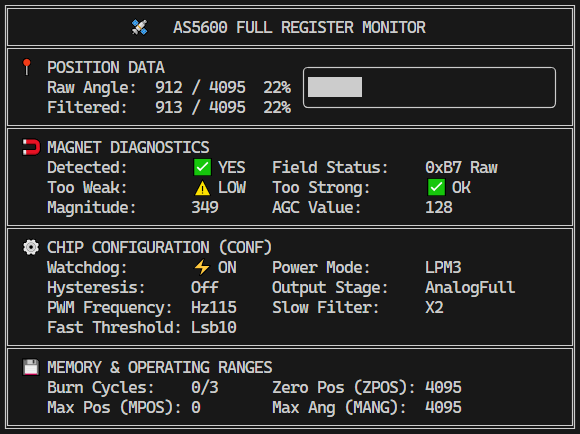

# AS5600 Linux Dashboard Example

This example demonstrates a real-time monitoring dashboard for the **AS5600** magnetic rotary encoder running on **Linux** (Raspberry Pi, Radxa, Orange Pi, Jetson, etc.) using `linux-embedded-hal`.

## 📸 Preview


## ✨ Features
- **High-Precision Progress Bar**: Uses Unicode sub-block characters for smooth visual feedback.
- **Full Register Monitoring**: Displays real-time data from all internal registers via I2C.

## 🔌 Connection (Generic Linux SBC)
Connect the sensor to the primary I2C bus (usually I2C1):

| AS5600 Pin | SBC Pin (Header) | Note |
|------------|------------------|------|
| **VCC**    | 3.3V             | Check your board's logic level |
| **GND**    | GND              | Common ground |
| **SDA**    | I2C SDA          | (e.g., Pin 3 on RPi) |
| **SCL**    | I2C SCL          | (e.g., Pin 5 on RPi) |

## 🛠 Prerequisites

1. **Enable I2C**: Ensure the I2C interface is enabled in your system (e.g., via `raspi-config` or `armbian-config`).
2. **Permissions**: Your user must be in the `i2c` group or run the program with `sudo`.
    ```bash
    sudo usermod -aG i2c $USER
    ```
3. **Verify sensor**:
    ```bash
    sudo i2cdetect -y 1
    ```
    *You should see the device at address `0x36`.*

## 🛠 Project Structure
- `src/main.rs`: Uses `linux-embedded-hal::I2cdev` to access the sensor via `/dev/i2c-1`.
- `Cargo.toml`: Minimal dependencies for Linux environments.
